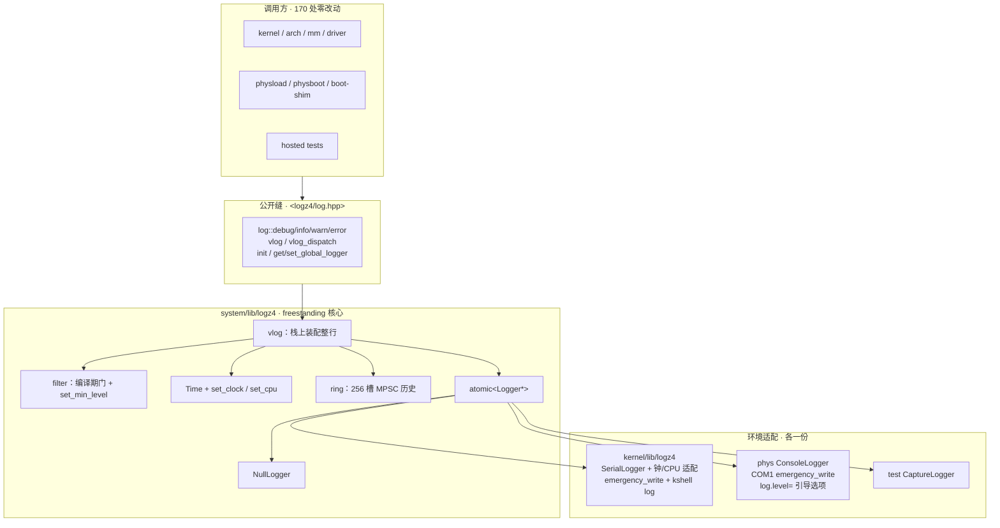
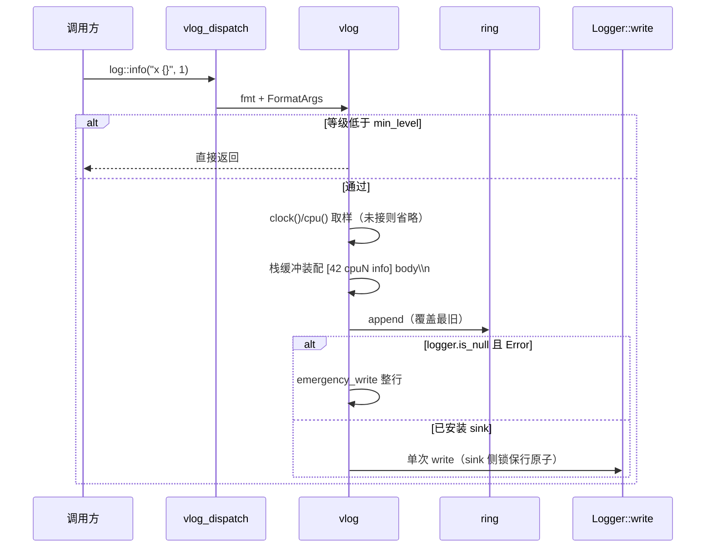
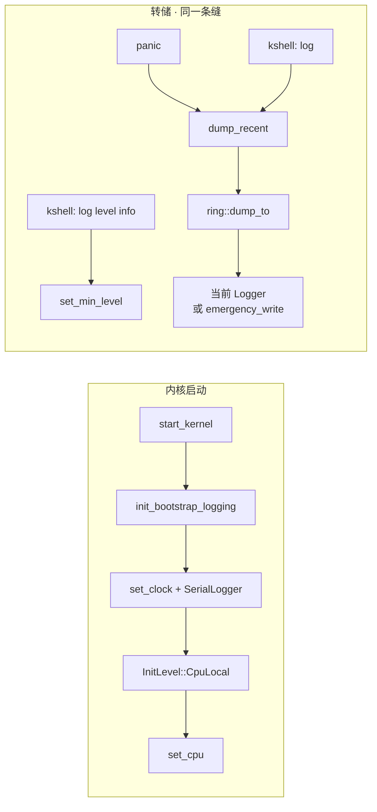

# logz4 架构

调用点仍走 `#include <logz4/log.hpp>` 与 `log::info(...)`。环是历史记录器，不是异步队列。

前缀第一项是 `Time`（何时发生）。外部 `set_clock` 接上钟；单位是钟的，核心不换算。

## 分层

```mermaid
flowchart TB
  subgraph callers["调用方 · 170 处零改动"]
    K["kernel / arch / mm / driver"]
    P["physload / physboot / boot-shim"]
    H["hosted tests"]
  end

  subgraph api["公开缝 · &lt;logz4/log.hpp&gt;"]
    API["log::debug/info/warn/error<br/>vlog / vlog_dispatch<br/>init / get/set_global_logger"]
  end

  subgraph core["system/lib/logz4 · freestanding 核心"]
    VLOG["vlog：栈上装配整行"]
    FILT["filter：编译期门 + set_min_level"]
    CLK["Time + set_clock / set_cpu"]
    RING["ring：256 槽 MPSC 历史"]
    GLOG["atomic&lt;Logger*&gt;"]
    NULL["NullLogger"]
  end

  subgraph glue["环境适配 · 各一份"]
    KG["kernel/lib/logz4<br/>SerialLogger + 钟/CPU 适配<br/>emergency_write + kshell log"]
    PG["phys ConsoleLogger<br/>COM1 emergency_write<br/>log.level= 引导选项"]
    HG["test CaptureLogger"]
  end

  callers --> api --> VLOG
  VLOG --> FILT
  VLOG --> CLK
  VLOG --> RING
  VLOG --> GLOG
  GLOG --> NULL
  GLOG --> KG
  GLOG --> PG
  GLOG --> HG
```

## 一条日志

```mermaid
sequenceDiagram
  participant C as 调用方
  participant D as vlog_dispatch
  participant V as vlog
  participant R as ring
  participant L as Logger::write

  C->>D: log::info("x {}", 1)
  D->>V: fmt + FormatArgs
  alt 等级低于 min_level
    V-->>C: 直接返回
  else 通过
    V->>V: clock()/cpu() 取样（未接则省略）
    V->>V: 栈缓冲装配 [42 cpuN info] body\\n
    V->>R: append（覆盖最旧）
    alt logger.is_null 且 Error
      V->>V: emergency_write 整行
    else 已安装 sink
      V->>L: 单次 write（sink 侧锁保行原子）
    end
  end
```

## 启动与转储

```mermaid
flowchart LR
  subgraph kernel_boot["内核启动"]
    B1["start_kernel"] --> B2["init_bootstrap_logging"]
    B2 --> B3["set_clock + SerialLogger"]
    B3 --> B4["InitLevel::CpuLocal"]
    B4 --> B5["set_cpu"]
  end

  subgraph dump["转储 · 同一条缝"]
    PNC["panic"] --> DR["dump_recent"]
    SH["kshell: log"] --> DR
    SH2["kshell: log level info"] --> ML["set_min_level"]
    DR --> RING2["ring::dump_to"]
    RING2 --> SINK["当前 Logger<br/>或 emergency_write"]
  end
```
